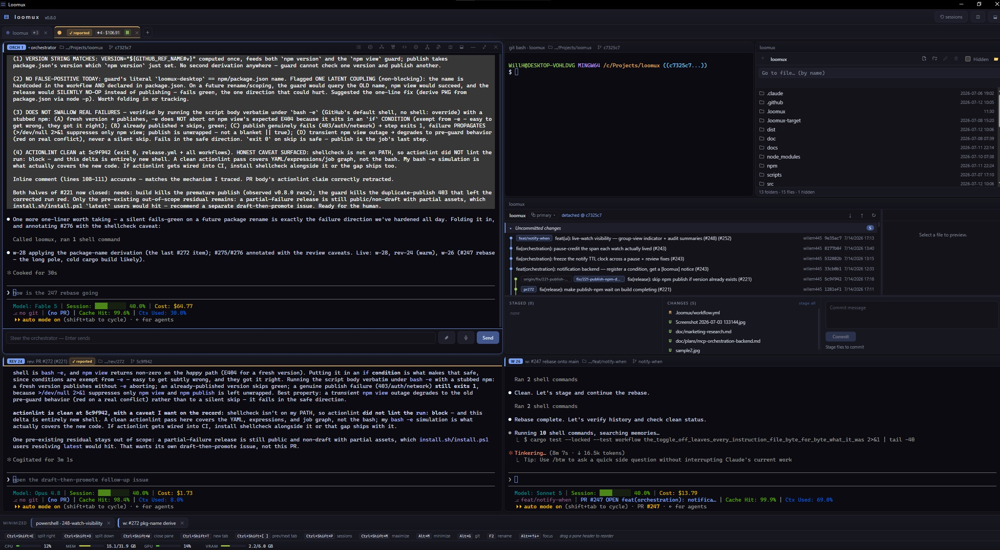

<p align="center">
  
</p>

# Orrerix

**Define the vision. Walk away. Come back to shipped software.**

Every agent turn ends the same way: it stops and waits for you. So you wait
too — eyes on the terminal, phone out at dinner, refreshing to see if it's done
so you can type the next prompt. You bought an assistant and became one.

I built Orrerix to end that loop. Hand it a backlog, close the laptop, and come
back to merged pull requests — while you're out living your life instead of
babysitting a cursor.

Orrerix runs fleets of AI coding agents unsupervised, on real software
discipline: review gates and green CI before anything merges, work tracked on
GitHub and a live task board, your own CLIs and custom workflows — agents
follow the process, not the other way around.

[](https://github.com/willem445/orrerix/actions/workflows/ci.yml)
[](https://willem445.github.io/orrerix/)
[](#hand-it-a-batch-of-work-and-walk-away)



**Orrerix builds itself.** 82% of its own active development time — 22.3 of
27.2 hours — ran with no human present: agents alone planning, building,
adversarially reviewing and shipping the work, with humans holding only the merge
and release gates. 48 human touch-points (prompts, merge approvals, release
grants) against ~21,600 audited agent/system events — about 0.2%.

It started as a terminal. I tried every multiplexer I could find and each one
had a quirk I couldn't live with, so I built the one I wanted — a native desktop
terminal for Windows, macOS and Linux with instant matrix splits, nameable panes,
project tabs and session restore — and kept building. Today it is everything I
need in one window: terminals, SSH, git, a file explorer and editor, and the
agents themselves, with an **orchestrator/worker workflow built in**. It has
replaced VS Code for me.

Point a group at a repo, label some GitHub issues, and an orchestrator plans the
work, spawns workers and reviewers into their own panes and their own git
worktrees, and drives each issue to a pull request. Every prompt it sends is
*typed into a pane you can read*, so you can
steer any agent mid-task by just typing, or take the keyboard entirely. And by
default no agent merges: that button stays yours.

The name comes from the **orrery**: a desk-sized geared model of the solar
system where every planet and moon runs its own track at its own period, and the
whole model stays in phase because one mechanism drives all of it — like the
Whipple Museum's [Grand Orrery](https://www.whipplemuseum.cam.ac.uk/explore-whipple-collections/astronomy/grand-orrery). That is the product: agents each working
their own track in their own pane, one orchestrator holding the phase.

## Quickstart

```sh
npx orrerix            # Node 18+, any platform — downloads and launches
npm install -g orrerix # …or install it and just run `orrerix`
```

Then, in the app: open a pane → **Orchestrator + workers** → pick the repo, an
agent CLI and model per role, and how many workers to start with. You'll need the
`claude` or `copilot` CLI on `PATH`, and an authenticated `gh` for the issue/PR
flow. Full walkthrough in [Getting started](https://willem445.github.io/orrerix/getting-started).

<details>
<summary>Other install paths — Windows / macOS / Linux one-liners, release assets, betas, upgrading from Loomux</summary>

**Windows**

```powershell
powershell -ExecutionPolicy Bypass -c "irm https://raw.githubusercontent.com/willem445/orrerix/main/install.ps1 | iex"
```

**macOS / Linux**

```sh
curl -fsSL https://raw.githubusercontent.com/willem445/orrerix/main/install.sh | sh
```

Or grab an installer from the
[latest release](https://github.com/willem445/orrerix/releases/latest) (`.exe`/`.msi`,
`.dmg`, `.AppImage`/`.deb`/`.rpm`).

`npx orrerix` and both one-liners always resolve the latest **stable**
release — beta/RC builds are published as GitHub prereleases only, so grab those
from [the releases page](https://github.com/willem445/orrerix/releases) directly.

Builds are unsigned for now — on macOS, if the app is reported as damaged, run
`xattr -cr /Applications/Orrerix.app` (the install script does this for you).

**Coming from Loomux?** Orrerix installs beside your old Loomux app rather than
over it, and `loomux-desktop` is off npm with no shim. The uninstall commands and
what carries over are in
[Getting started → Upgrading from Loomux](https://willem445.github.io/orrerix/getting-started#upgrading-from-loomux).

</details>

## Hand it a batch of work and walk away

Label a few issues `agent-ready`, set a token budget, flip **Autonomous mode** on
— and close the laptop. The orchestrator keeps pulling labeled work off the board
for as long as you leave it running, hours or days, without you poking it.

That's only sane because the guardrails live in orrerix itself, outside the agent
process — not in a prompt asking an agent nicely:

- **It won't merge or publish.** Every agent pane runs behind a `gh`/`git` shim
  that *refuses* a default-branch merge or a release/tag push unless you
  authorized it — with a one-click, single-use, 30-minute grant for one specific
  PR, or a blanket toggle you turned on yourself. Auto-merge and auto-release are
  separate opt-ins, both off by default. The shim is the always-on first layer,
  and it's honest about being one: it raises a bad unattended merge from "type one
  command" to "deliberately evade a named control", but a determined agent with
  shell access can still route around a client-side check. For a boundary nothing
  can talk past, give your agents a machine account with no merge rights on the
  default branch and no tag-push rights — the two layers compose, and
  [the docs walk through both](https://willem445.github.io/orrerix/autonomous-mode#the-merge--release-gate).
- **It can't overspend.** Crossing the token budget suspends autonomous mode
  unconditionally — even if the state file can't be written — and the suspension
  survives a restart.
- **It doesn't burn tokens on nothing.** Before waking the orchestrator, orrerix
  runs a zero-token, host-side check for actual new work (`gh issue list` /
  `gh pr list`, no LLM turn). A tick with nothing to report is skipped quietly.
- **It survives a restart.** Queued prompts live on disk and re-queue in order
  when their pane is back; a whole group resumes, orchestrator first.
- **Nothing wedges silently.** A prompt that reaches a pane but never gets
  submitted is re-sent once; when re-sending isn't safe, the pane raises a red
  **stuck prompt** chip instead of waiting forever.

Prefer to stay in the loop? Leave autonomous off — that's the default, and the
orchestrator then only acts when you or a worker poke it.

## How a group works


Workers and reviewers *always* get their own dedicated git worktree — cut fresh
from the default branch — so your own clone is never checked out, branched or
committed to from under you, and parallel work starts from a clean base. The
planner is read-only: no worktree, no file edits, no `git commit`/`push`,
enforced at the CLI level.

## Why orrerix over…

- **tmux / zellij / [herdr](https://github.com/ogulcancelik/herdr)** — they
  multiplex your agents; orrerix manages your agents' *work*.
- **Prompt-layer orchestrators
  ([superpowers](https://github.com/obra/superpowers),
  [gstack](https://github.com/garrytan/gstack),
  [oh-my-claudecode](https://github.com/yeachan-heo/oh-my-claudecode),
  [gsd-pi](https://github.com/open-gsd/gsd-pi))** — review gates written as
  prompts *inside* one agent CLI, which an agent can talk its way past. Orrerix
  gates from outside the process instead — host-side, and backed by a machine
  account when you want it airtight. Complementary, not competing — install them
  inside a worker's pane.
- **IDE-shaped agent platforms** — orrerix is still a terminal: lightweight,
  native, and it opens *your* editor instead of embedding one.
- **Unattended fleets you can't see** — every agent here works in a pane you can
  read and interrupt mid-task, and the merge button stays human by default.

## What else is in the box

- **Agent-aware panes** — alert chips when a CLI needs you, badges per role and
  group, and a session browser that restores Claude Code / Copilot CLI sessions
  straight back into a pane.
- **Restart it and pick up exactly where you left off** — click a closed
  group's Resume card and every member with a resumable session id relaunches
  on its own resumed CLI session, full conversation history and all, with
  persona and worktree restored too. The task board, delivery queue and
  question registry are never lost — persisted to disk the whole time, so
  queued deliveries redeliver in order to a pane that rebinds, and surface as
  an explicit to-do list for the rest. Crash logs and startup breadcrumbs ship
  in every build.
- **Custom agent workflows** — commit a `.orrerix/workflow.yml` and your repo
  declares its own roster and merge gate: five focused reviewers with five
  prompts and five models, an advisor the orchestrator consults when stuck, a
  process agent that mines a finished session into a proposed lessons PR.
- **A bisecting merge queue** — opt in and a batch of approved sub-PRs is tested
  *together* on a scratch ref before any of them lands, because five green PRs
  can still make a red branch. The commit CI tested is the commit that lands; if
  the batch breaks, orrerix bisects and tells you which PR did it instead of
  leaving someone to guess. It lands only on an integration branch, never your
  default one.
- **A real terminal underneath** — WezTerm's PTY layer and xterm.js, so escape
  sequences, colors and wide characters render like a native terminal. Panes
  never resize for a UI feature.
- **Git, issues, files, voice** — a git view, GitHub issues, a file editor, a
  file explorer and push-to-talk voice prompts, each one keystroke away. Float
  them over the terminal, or **dock** up to three of them beside it (left, right,
  bottom) with a draggable divider.
- **Audit everything** — every prompt, spawn, gate decision and toggle change is
  one filterable row in the group's audit log, or one dot on a progress timeline
  that plots it alongside the repo's issue and PR history.
- **Lessons that outlive a session** — a committed `.orrerix/lessons.md` feeds
  hard-won repo knowledge into the next orchestrator's kickoff.

## Documentation

**User docs → <https://willem445.github.io/orrerix/>**

- [Getting started](https://willem445.github.io/orrerix/getting-started) — install, first launch, first agent pane
- [Core concepts](https://willem445.github.io/orrerix/core-concepts) — pane kinds, the split grid, the shortcut table
- [Orchestration guide](https://willem445.github.io/orrerix/orchestration) — groups, the task board, the label handshake, cross-workspace channels
- [Autonomous & supervised modes](https://willem445.github.io/orrerix/autonomous-mode) — idle ticks, token budget, auto-merge/release, dangerous mode
- [Troubleshooting](https://willem445.github.io/orrerix/troubleshooting) — whisper DLLs, `gh` auth, mic permission, disk

The site is built from Markdown under [`docs/`](docs/) and published on each
release by [`.github/workflows/docs.yml`](.github/workflows/docs.yml).

## Develop

Rust + [Tauri 2](https://tauri.app) + [`portable-pty`](https://crates.io/crates/portable-pty)
on the back end; [xterm.js](https://xtermjs.org) + vanilla TypeScript + Vite on the
front end, no UI framework.

```sh
npm install          # once
npm run tauri dev    # develop (hot-reloads the UI)
npm run tauri build  # produce a distributable app / installer
npm test             # frontend unit tests (Node's built-in runner)
```

Backend checks (what CI gates on) run from the repo root: `cargo check --locked
--workspace` and `cargo test --locked --workspace`.

- **[`CLAUDE.md`](CLAUDE.md)** — hard constraints and code conventions. Read it
  before changing code.
- **[`docs/design/architecture.md`](docs/design/architecture.md)** — the source tree,
  module by module, and the extension seams.
- **[`docs/design/`](docs/design/)** — per-feature design notes: *why* each subsystem
  is built the way it is.
- **E2E** (experimental, `e2e-windows` CI job) — Playwright over CDP against the
  real WebView2 webview: [`docs/design/e2e-testing.md`](docs/design/e2e-testing.md).
- `ORRERIX_DATA_DIR` redirects the **entire** app-data root to an absolute path,
  for a fully isolated second profile (the E2E harness uses it). Without it the
  root is `<platform data dir>/orrerix`. A repo's committed config lives in
  `.orrerix/` (`workflow.yml`, `lessons.md`, `workflow.layout.json`).
- **The Loomux → Orrerix rename** — the one-time data-dir move, the `LOOMUX_*`
  env-var and `.loomux/` config fallbacks, the protocol strings agents match on
  (one spelling emitted, every spelling accepted), and the npm/app/asset
  identities are each specified in their own note:
  [`rebrand-filesystem.md`](docs/design/rebrand-filesystem.md),
  [`rebrand-protocol.md`](docs/design/rebrand-protocol.md),
  [`rebrand-external.md`](docs/design/rebrand-external.md).

The Windows installer ships one prebuilt, MIT-licensed runtime — a modern ConPTY
host (`conpty.dll` + `OpenConsole.exe`, committed in
`src-tauri/resources/conhost/`) for clean terminal resize; see
[`THIRD_PARTY_NOTICES.md`](THIRD_PARTY_NOTICES.md). Voice input's whisper.cpp
runtime is **not** shipped — it's an opt-in download.
