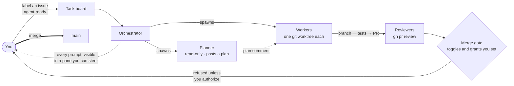

# Design note: the group-workflow diagram

The README's `## How a group works` section shows a designed SVG
(`docs/img/workflow-diagram.svg`) of the same flow described in
`docs/orchestration.md`'s "How it works": you define the vision, the
orchestrator grooms it into issues and board tasks, spawns a planner where
warranted and workers in isolated worktrees, routes work through adversarial
review gates and CI, and only a verdict-gated merge reaches `main`.

This Mermaid flowchart is the **maintainable source** for that same flow —
edit it here and re-export the README's SVG to match. It lives here rather
than under `docs/` (the published user-docs site) because that site's
`just-the-docs` theme has no `mermaid:` key configured, so a Mermaid fence
there would publish as raw, unrendered DSL rather than a diagram. GitHub's
own file viewer renders a Mermaid fence natively with no configuration
needed — the same mechanism the README's diagram relied on before this SVG
replaced it.

## Checking a Mermaid render claim

Neither instrument this repo otherwise reaches for can see a Mermaid fence, and both
fail *silently, in opposite directions*:

- **The GFM endpoint** (`gh api -X POST markdown -f mode=gfm`, which `CLAUDE.md`
  mandates for render claims) returns a ```` ```mermaid ```` fence as a
  `<div class="highlight highlight-source-mermaid"><pre>` — syntax-highlighted DSL,
  indistinguishable from the unrendered-fence failure you are checking for. Read
  literally it says *every* Mermaid fence fails, including the ones GitHub renders fine.
- **A headless screenshot of the blob page** is non-deterministic: GitHub renders the
  diagram inside a cross-origin sandboxed iframe that does not reliably complete in a
  signed-out headless browser. In #1324 the identical technique against the identical
  URL was run twice and produced opposite readings, one of which reached a PR body as
  evidence before a re-review withdrew it.

So decide it from the **surface**, which is a config fact rather than a measurement:
GitHub's own file/README viewer renders a fence natively; the published Jekyll site
renders one only if `docs/_config.yml` gains a `mermaid:` key, which it has not. Where
a fence *moves* between files, corroborate by diffing it byte-for-byte against a fence
already known to render on the destination surface — same DSL and same renderer, and a
containing file's path does not change Mermaid support.


